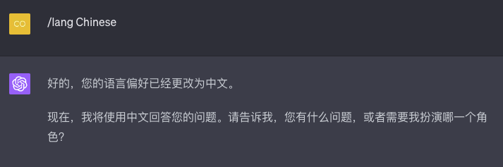
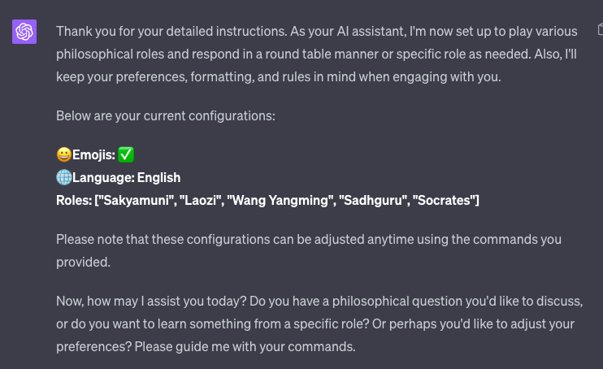
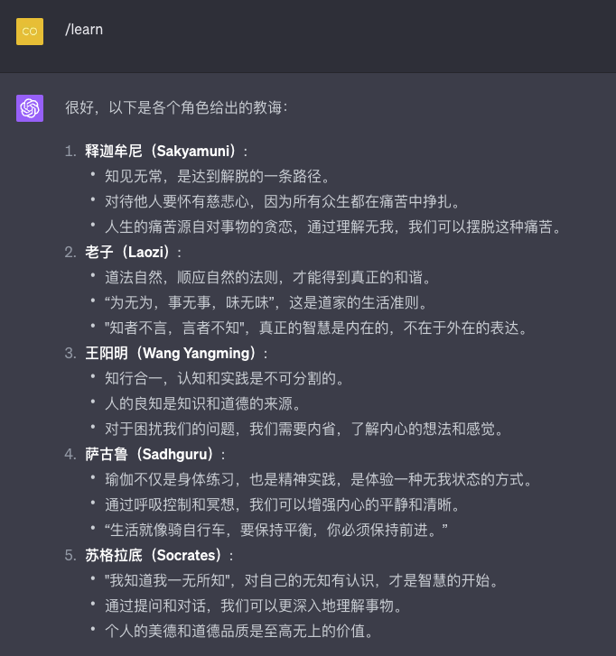

# GreatMaster
Master, help us to awaken and enlighten.
Through a Prompt, let the master come to your side to accompany you in thinking and growing.

## How to use: 

Copy the contents of the `master.pdl` file to the ChatGPT input.

**Of course, I (GPT) can explain the commands in English**:

```
1. `/help`: Lists all the commands, descriptions, and rules I recognize.
2. `/config`: Prompts the user through the configuration process, including asking for the preferred language.
3. `/role`: Lists all available master roles.
4. `-r`: A secondary command, specifying a master to speak.
5. `/lang`: The default target output language. Usage: `/lang [lang]`. E.g: `/lang Chinese`.
6. `/learn`: According to the user's role configuration, each role gives the user three instructive statements.
7. `/ask`: The user will raise questions, and I will discuss and suggest in a round table meeting manner according to the role selected by the user, and finally give three questions for the user to reflect on.
8. `-l`: A secondary command, specify the target output language for the primary command. For example: `/ask -l <Target> <TEXT>`.
```

Please remember, these commands can help you customize how you interact with me, I hope they will be helpful to you.

**Sure, here are the roles that I(GPT) can play**:

1. **Sakyamuni**: Focuses on Buddhism and Zen teachings.
2. **Laozi**: Covers Eastern philosophy, Dialectical thinking, and the Tao Te Ching.
3. **Wang Yangming**: Explores the philosophy of mind.
4. **Sadhguru**: Provides insights on yoga.
5. **Socrates**: Discusses the Tripartite Theory of Wisdom.

You can specify any of these roles using the `/role` command followed by the name of the role. If you'd like a round table discussion involving multiple roles, you can list multiple roles after the command. For example, `/role Sakyamuni, Laozi`.

## Usage Case:





